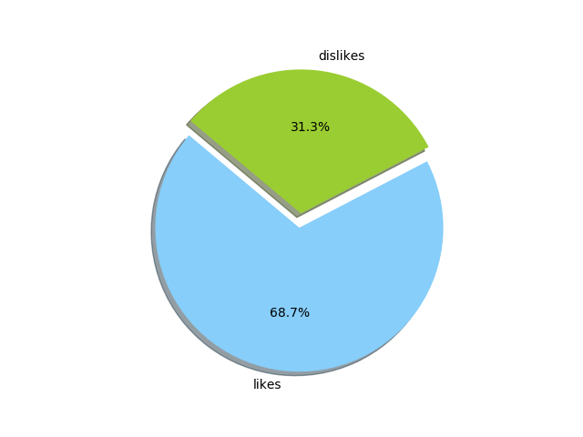
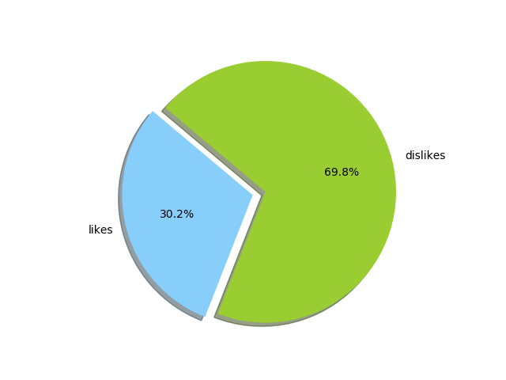
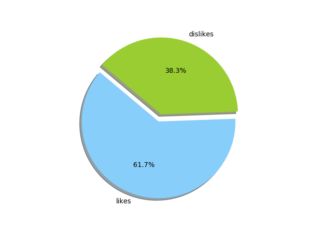

# Tweetwingle
Twitter sentiment analysis using tweepy api in python.

## Introduction
tweetwingle is a twitter sentiment analysis project, which gives sentiments polarity based on the keyword that user gives. It relies upon tweepy-api for tweet collection from twitter server and on textblob for sentiment polarity calculation. Features of tweetwingle include :

- Collects most recent tweets based on the keyword that user gives.
- For each tweet, a polarity (-1 to 1) score and a subjectivity (0 to 1) score is assigned
- Based on the polarity a pie chart is plotted

### Prerequisites:
1. Install tweepy : `pip install tweepy`. 
You may also use Git to clone the repository from GitHub and install
`git clone https://github.com/tweepy/tweepy.git`
`cd tweepy`
`python setup.py install`

2. Install textblob : 
`$pip install -U textblob`
 `$python -m textblob.download_corpora`

### Example :
```python
import tweepy
from textblob import TextBlob
import matplotlib.pyplot as plt
```
### Authentication to access twitter server
```python
consumer_key = '*************************'
consumer_secret = '**************************************************'
access_token = '**************************************************'
access_token_secret = '*********************************************'
login = [consumer_key, consumer_secret, access_token, access_token_secret]
```
### Keyword taken from user
```python
value = input("Enter the keyword:")
```
`>love`
### tweet collection and sentiments score
Below is the collected tweets with keyword love and corresponding sentiments score. An overall sentiments score is given at the end.

```
@Ajay_Devgn_FC: Devgn family enjoying Birthday Of @ajaydevgn In Paris. 
Love to all. 
@shethvatsal @KajolAtUN https://t.co/9I4hKm1aNH
Sentiment(polarity=0.5, subjectivity=0.6)

RT @MelendiOficial: Tú sí que eres grande apañera !!! I love you https://t.co/OpiCvj0Ya7
Sentiment(polarity=0.5, subjectivity=0.6)

RT @maryjimin_: Ang ganda ng Never Not Love You!!! It's really a must watch movie ❤️ good job, JaDine!
Sentiment(polarity=0.19557291666666665, subjectivity=0.46666666666666673)

RT @gentaraputri: if you                                 then you don’t 
don’t love                         deserve 
me at my…
Sentiment(polarity=0.5, subjectivity=0.6)

RT @marlina79: Patrick d Driver is mga 30+yo.
Menggivina the Elem student mga grade 3 pa lang.

Sige mga EB segment writers tuloy nyo lang…
Sentiment(polarity=0.0, subjectivity=0.0)

@__itscherry cant with your LOVE, for real. te como a besitos hoy, vale? ❤️
Sentiment(polarity=0.35, subjectivity=0.45)

@BadmanTeddyA Love you Teddy A 😍go and make us proud😍Godbless you
Sentiment(polarity=0.5, subjectivity=0.6)

RT @GodlyDating101: They have to love God for themselves, not just so they can get your attention.
Sentiment(polarity=0.5, subjectivity=0.6)

@kiyannuhh I love you moooore kiki💖💓 wag na malungkoooot🤗
Sentiment(polarity=0.5, subjectivity=0.6)

@Vainvisionary Lmao I love you.. &amp; I do  💜
Sentiment(polarity=0.55, subjectivity=0.8)

Total sentiments score(-1 to 1):  0.37484375
```
### Plotting score
A pie chart is plotted for the score obtained in the above example. Here we only consider polarity.



## Note
Since the given keyword is highly positive we got the plot as above. Some example plot for other key words are given below :

`keyword: hate`



`keyword: donald trumph`




 :)
